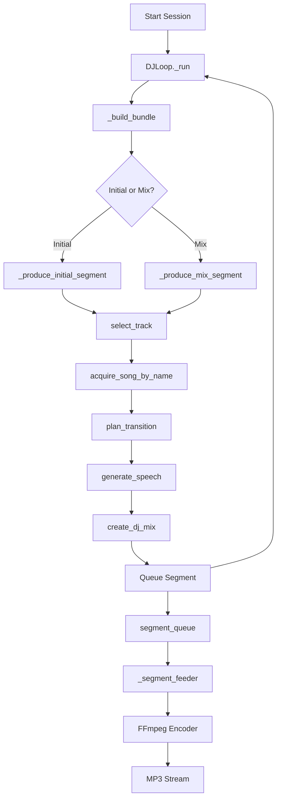
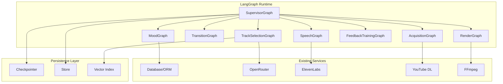
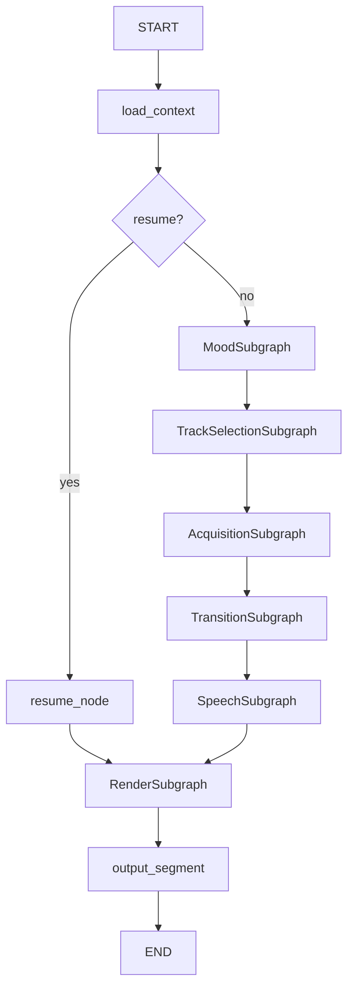
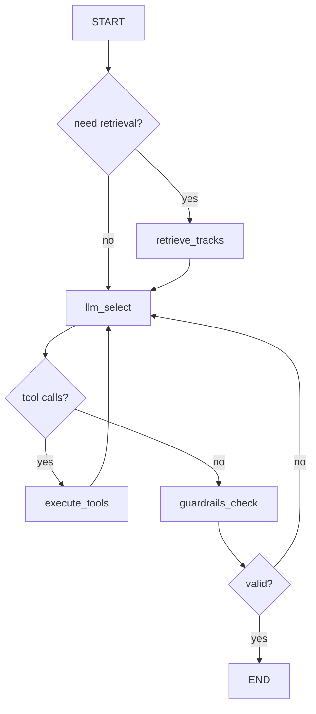

# AI DJ v3 - LangGraph Implementation Plan

## Executive Summary

This document outlines the complete plan to refactor the AI DJ backend from v2 (imperative orchestration) to v3 (LangGraph-based agentic architecture). The goal is to leverage LangGraph's StateGraph, persistence, memory, and subgraph patterns to create a more modular, observable, and resilient DJ orchestration system.

---

## 1. Current Architecture Summary (v2)

### 1.1 Core Modules

| Module | Purpose |
|--------|---------|
| `streaming/pipeline.py` | `UserRadioPipeline` - Per-user FFmpeg encoder, segment queue, PCM feeding |
| `orchestration/loop.py` | `DJLoop` - Main orchestration loop that produces segments |
| `orchestration/agents.py` | Agent functions: `select_track`, `plan_transition`, `generate_speech` |
| `orchestration/tool_based_selector.py` | Tool-calling track selector with DB tools |
| `orchestration/agentic_trainer.py` | Agentic feedback training with tool access |
| `services/preference_bundle.py` | `PreferenceBundle` - Aggregated user context |
| `services/acquisition.py` | Multi-provider song acquisition (cache, YouTube) |
| `services/training.py` | Feedback training for mood profiles |
| `services/persona.py` | DJ persona compilation with cooldowns |
| `services/mood_generator.py` | Personalized mood generation |
| `integrations/db_tools.py` | 15+ database tools for AI agents |
| `integrations/openrouter.py` | LLM client with tool calling support |

### 1.2 Current Data Flow



### 1.3 Segment Queue Contract

```python
segment_meta = {
    "path": "/path/to/audio.wav",
    "song_uuid": "uuid-string",
    "title": "Song Title",
    "artist": "Artist Name", 
    "duration": 240.0,
    "start_offset_sec": 0.0,  # For resume
    # Additional metadata...
}
```

### 1.4 Pain Points in v2

1. **Monolithic loops**: `_produce_mix_segment` is 400+ lines
2. **No state persistence**: Restart = lost state
3. **Limited observability**: Hard to trace agent decisions
4. **No memory across sessions**: Each session starts fresh
5. **Tight coupling**: Hard to test components in isolation
6. **No RAG**: Track selection doesn't use vector similarity

---

## 2. Proposed v3 Architecture (LangGraph)

### 2.1 High-Level Architecture



### 2.2 Key Design Principles

1. **Subgraphs for modularity**: Each concern is a separate graph
2. **Shared state schema**: All graphs work with `DJStateV3`
3. **Persistence first**: Every graph invocation is checkpointed
4. **Long-term memory**: User preferences stored in namespaced Store
5. **RAG for selection**: Vector search for track discovery
6. **Deterministic nodes**: Side effects isolated in dedicated nodes
7. **Backward compatibility**: Feature flag to toggle v2/v3

---

## 3. State Schema

### 3.1 DJStateV3 TypedDict

```python
from typing import TypedDict, Optional, List, Dict, Any
from typing_extensions import Annotated
from langgraph.graph import add_messages

class DJStateV3(TypedDict):
    # === Identity (immutable per session) ===
    user_id: str
    session_id: str
    thread_id: str  # Alias for session_id, used by checkpointer
    mood_id: Optional[str]
    context_name: Optional[str]
    
    # === Execution State ===
    step_id: int  # Increments each super-step
    segment_index: int  # Number of segments produced
    last_error: Optional[str]
    debug_events: List[Dict[str, Any]]
    
    # === Playback State ===
    current_song: Optional[Dict[str, Any]]  # Currently playing
    last_song: Optional[Dict[str, Any]]  # Previous song
    songs_played: List[str]  # UUIDs of played songs
    
    # === Resume State ===
    resume_song_uuid: Optional[str]
    resume_position_sec: Optional[float]
    
    # === Preferences (from PreferenceBundle) ===
    bundle_snapshot: Optional[Dict[str, Any]]  # Serialized PreferenceBundle
    disliked_uuids: List[str]
    artist_cooldowns: Dict[str, int]  # artist -> segments until playable
    
    # === RAG Context ===
    retrieval_query: Optional[str]
    retrieved_docs: List[Dict[str, Any]]
    retrieval_sources: List[str]
    
    # === Selection State ===
    candidate_tracks: List[Dict[str, Any]]
    selected_track: Optional[Dict[str, Any]]
    selection_rationale: Optional[str]
    
    # === Acquisition State ===
    acquisition_status: Optional[str]  # PENDING, ACQUIRED, FAILED
    local_path: Optional[str]
    
    # === Transition State ===
    transition_plan: Optional[Dict[str, Any]]
    
    # === Speech State ===
    speech_script: Optional[str]
    tts_path: Optional[str]
    
    # === Output ===
    next_segment_meta: Optional[Dict[str, Any]]  # Final output
    
    # === Feedback ===
    pending_feedback: Optional[Dict[str, Any]]
    training_signals: List[Dict[str, Any]]
    
    # === Messages (for tool calling) ===
    messages: Annotated[List[Any], add_messages]
```

### 3.2 Mapping to DB Models

| State Field | DB Model(s) |
|-------------|-------------|
| `user_id` | `User.id` |
| `session_id` | `Session.id` |
| `mood_id` | `Mood.id` |
| `current_song` | `Song` (joined) |
| `songs_played` | `PlayHistory.song_uuid` |
| `disliked_uuids` | `FeedbackEvent` where type=dislike |
| `bundle_snapshot` | `PreferenceBundle` (computed) |
| `transition_plan` | Generated by LLM |
| `next_segment_meta` | Output format |

---

## 4. Graphs and Subgraphs

### 4.1 SupervisorGraph (Main Agent)

**Purpose**: Top-level orchestration routing between specialized subgraphs.

**File**: `backend_v2/langgraph_v3/graphs/supervisor.py`



**Nodes**:
1. `load_context` - Load PreferenceBundle, history, feedback from DB
2. `route_resume` - Conditional: skip selection if resuming
3. Subgraph invocations for each specialized graph
4. `output_segment` - Finalize and return segment_meta

### 4.2 TrackSelectionGraph

**Purpose**: Select next track using tool-calling + optional RAG.

**File**: `backend_v2/langgraph_v3/graphs/track_selection.py`

**Reuses**: `orchestration/tool_based_selector.py` logic



**Key Features**:
- `require_tool_calls=True` guardrail
- Artist cooldown enforcement
- Duplicate detection
- RAG pre-retrieval for diversity

### 4.3 MoodGraph

**Purpose**: Select/refresh mood targets and enrichment.

**File**: `backend_v2/langgraph_v3/graphs/mood.py`

**Reuses**: `services/mood_generator.py`, `services/mood_enrichment.py`

**Nodes**:
1. `load_mood` - Fetch mood from DB
2. `enrich_mood` - Optional LLM enrichment
3. `set_targets` - Update state with energy/valence targets

### 4.4 SpeechGraph

**Purpose**: Generate DJ speech script and TTS audio.

**File**: `backend_v2/langgraph_v3/graphs/speech.py`

**Reuses**: `services/persona.py`, intro generation logic

**Nodes**:
1. `compile_persona` - Build DJPersona from bundle + store memory
2. `write_speech` - LLM generates script
3. `synthesize_tts` - Call ElevenLabs
4. `record_topics` - Update store with used roast topics

### 4.5 TransitionGraph

**Purpose**: Plan transition type and timing.

**File**: `backend_v2/langgraph_v3/graphs/transition.py`

**Reuses**: `agents.py:plan_transition`, `integrations/openrouter.py:generate_transition_plan`

**Nodes**:
1. `analyze_tracks` - Extract audio features
2. `plan_transition` - LLM generates plan with audio snippets
3. `normalize_plan` - Clamp values to safe ranges

### 4.6 AcquisitionGraph

**Purpose**: Ensure track exists locally; download if missing.

**File**: `backend_v2/langgraph_v3/graphs/acquisition.py`

**Reuses**: `services/acquisition.py`, `tools/song_downloader.py`

**Nodes**:
1. `check_local` - Check if file exists
2. `acquire_track` - Download via providers (YouTube, etc.)
3. `fallback_track` - Select alternative if download fails

**Idempotency**: Download locks prevent duplicate downloads.

### 4.7 RenderGraph

**Purpose**: Render final audio segment.

**File**: `backend_v2/langgraph_v3/graphs/render.py`

**Reuses**: `audio/mix.py:create_dj_mix`

**Nodes**:
1. `prepare_inputs` - Validate paths and parameters
2. `render_mix` - Call FFmpeg via create_dj_mix
3. `build_segment_meta` - Construct output dict

### 4.8 FeedbackTrainingGraph

**Purpose**: Process feedback and update long-term memory.

**File**: `backend_v2/langgraph_v3/graphs/feedback_training.py`

**Reuses**: `services/training.py`, `orchestration/agentic_trainer.py`

**Nodes**:
1. `load_feedback` - Get pending feedback
2. `train_mood` - Update mood profile weights
3. `write_memory` - Store insights to long-term memory
4. `emit_events` - Notify frontend

---

## 5. Persistence and Memory

### 5.1 Short-Term Memory (Checkpointer)

**Thread ID Strategy**: `thread_id = session_id`

**Implementation**:
```python
# Dev/Test
from langgraph.checkpoint.memory import InMemorySaver
checkpointer = InMemorySaver()

# Production (optional)
from langgraph_checkpoint_sqlite import SqliteSaver
checkpointer = SqliteSaver.from_conn_string("data/checkpoints.db")
```

**Checkpoint Triggers**:
- After each node execution (automatic)
- Before/after side effects (explicit)

**APIs**:
```python
# Get current state
state = await graph.aget_state({"configurable": {"thread_id": session_id}})

# Get state history for time travel
history = await graph.aget_state_history({"configurable": {"thread_id": session_id}})
```

### 5.2 Long-Term Memory (Store)

**File**: `backend_v2/langgraph_v3/memory/store.py`

**Namespace Schema**:
```python
# User taste preferences (learned from feedback)
("user", user_id, "taste")
# Example: {"likes_indie_rock": 0.8, "dislikes_country": 0.9}

# Banter/roast constraints
("user", user_id, "banter")
# Example: {"roast_topics_used": ["job", "age"], "off_limits": ["family"]}

# Session summaries
("user", user_id, "session_summaries")
# Example: [{"session_id": "...", "summary": "Played 12 tracks, mostly upbeat"}]

# Transition recipes that worked
("user", user_id, "transition_recipes")
# Example: [{"from_genre": "pop", "to_genre": "rock", "type": "eq_blend"}]
```

**Implementation**:
```python
from langgraph.store.memory import InMemoryStore
store = InMemoryStore()

# Read
async def load_user_memory(user_id: str) -> Dict[str, Any]:
    taste = await store.aget(("user", user_id, "taste"), "preferences")
    banter = await store.aget(("user", user_id, "banter"), "constraints")
    return {"taste": taste, "banter": banter}

# Write
async def write_memory(user_id: str, namespace: str, key: str, value: Any):
    await store.aput(("user", user_id, namespace), key, value)
```

**Memory Update Triggers**:
1. After feedback is submitted (like/dislike/skip)
2. After each segment is rendered (session summary)
3. After training completes (preference deltas)

---

## 6. RAG Design

### 6.1 Document Types

| Doc Type | Source | Fields |
|----------|--------|--------|
| TrackDoc | `Song` + `SongFeatures` | uuid, title, artist, genres, bpm, energy, valence, play_count |
| FeedbackDoc | `FeedbackEvent` | track, feedback_type, reason, timestamp |
| TransitionRecipe | Store memory | from_genre, to_genre, type, success_rate |
| PersonaSnippet | `UserProfile` | roast_topics, tone, cultural_blend |

### 6.2 Index Implementation

**File**: `backend_v2/langgraph_v3/rag/index.py`

**Tech Stack**: FAISS (local) or Chroma (persistent)

```python
from langchain_community.vectorstores import FAISS
from langchain_openai import OpenAIEmbeddings

# Build index
def build_track_index(songs: List[Song]) -> FAISS:
    docs = [track_to_doc(song) for song in songs]
    embeddings = OpenAIEmbeddings(
        base_url="https://openrouter.ai/api/v1",
        api_key=os.getenv("OPENROUTER_API_KEY"),
        model="openai/text-embedding-3-small"
    )
    return FAISS.from_documents(docs, embeddings)
```

**Index Location**: `data/rag_index/`

**Update Cadence**:
- On startup: Load or rebuild if stale
- On track import: Incremental add
- Nightly: Full rebuild (cron job)

### 6.3 Retriever

**File**: `backend_v2/langgraph_v3/rag/retriever.py`

```python
def make_retrieval_query(state: DJStateV3) -> str:
    """Build retrieval query from state."""
    parts = []
    
    # Mood targets
    if state.get("bundle_snapshot"):
        mood = state["bundle_snapshot"].get("mood", {})
        parts.append(f"mood: {mood.get('name', 'unknown')}")
        parts.append(f"energy: {mood.get('energy_target', 0.5)}")
        parts.append(f"valence: {mood.get('valence_target', 0.5)}")
    
    # Diversity constraint
    recent = state.get("songs_played", [])[-5:]
    if recent:
        parts.append(f"NOT: {', '.join(recent)}")
    
    # Feedback signals
    if state.get("disliked_uuids"):
        parts.append(f"avoid: {len(state['disliked_uuids'])} disliked tracks")
    
    return " ".join(parts)

async def retrieve(state: DJStateV3, k: int = 8) -> List[Dict]:
    query = make_retrieval_query(state)
    vectorstore = get_vectorstore()
    docs = await vectorstore.asimilarity_search(query, k=k)
    return [doc.metadata for doc in docs]
```

### 6.4 Agentic RAG Routing

In `TrackSelectionGraph`:
```python
def should_retrieve(state: DJStateV3) -> bool:
    """Decide if RAG retrieval is needed."""
    # Skip if we already have candidates
    if state.get("candidate_tracks"):
        return False
    
    # Skip if first segment (use Spotify context directly)
    if state.get("segment_index", 0) == 0:
        return False
    
    # Retrieve for variety after N segments
    return state.get("segment_index", 0) % 3 == 0
```

---

## 7. Integration Plan

### 7.1 Entry Point

**Modified**: `streaming/pipeline.py` or `orchestration/loop.py`

```python
# In DJLoopV3 or modified DJLoop
async def _produce_segment_v3(self):
    """Produce segment using LangGraph SupervisorGraph."""
    from backend_v2.langgraph_v3.runtime import get_graph, invoke_segment
    
    segment_meta = await invoke_segment(
        user_id=self.user_id,
        session_id=self.session_id,
        mood_id=self.mood_id,
        context_name=self.context_name,
        resume_song_uuid=self.resume_song_uuid,
        resume_position_sec=self.resume_position_sec,
    )
    
    if segment_meta:
        await self.segment_queue.put(segment_meta)
```

### 7.2 Feature Flag

**Environment Variable**: `USE_LANGGRAPH_V3=true`

```python
# In loop.py
async def _run(self):
    if os.environ.get("USE_LANGGRAPH_V3") == "true":
        await self._run_v3()
    else:
        await self._run_v2()  # Existing logic
```

### 7.3 Segment Queue Integration

The SupervisorGraph output (`next_segment_meta`) must match the existing contract:

```python
def build_segment_meta(state: DJStateV3) -> Dict[str, Any]:
    """Build segment_meta matching pipeline contract."""
    return {
        "path": state["local_path"],
        "song_uuid": state["selected_track"]["uuid"],
        "title": state["selected_track"]["title"],
        "artist": state["selected_track"]["artist"],
        "duration": state["selected_track"].get("duration_sec", 0),
        "start_offset_sec": state.get("resume_position_sec", 0),
        "transition_type": state.get("transition_plan", {}).get("type", "crossfade"),
        "tts_path": state.get("tts_path"),
        "artwork_url": state["selected_track"].get("artwork_url"),
    }
```

---

## 8. Testing Plan

### 8.1 Unit Tests

| Test File | Coverage |
|-----------|----------|
| `tests/test_state_v3.py` | State helpers, validation |
| `tests/test_track_selection_graph.py` | Selection flow, tool calling |
| `tests/test_acquisition_graph.py` | Download, caching |
| `tests/test_render_graph.py` | Mix rendering |
| `tests/test_memory_store.py` | Store operations |
| `tests/test_rag_index.py` | Indexing, retrieval |

### 8.2 Integration Tests

**File**: `tests/test_langgraph_v3_integration.py`

```python
async def test_full_segment_generation():
    """Generate 2 segments end-to-end."""
    # Setup
    user_id, session_id, mood_id = await create_test_session()
    
    # Generate segment 1
    segment1 = await invoke_segment(user_id, session_id, mood_id)
    assert segment1["path"]
    assert os.path.exists(segment1["path"])
    
    # Generate segment 2 (should use state from segment 1)
    segment2 = await invoke_segment(user_id, session_id, mood_id)
    assert segment2["song_uuid"] != segment1["song_uuid"]  # Different track

async def test_state_persistence():
    """Verify state survives across invocations."""
    _, session_id, _ = await create_test_session()
    
    await invoke_segment(...)
    state = await get_thread_state(session_id)
    assert state["segment_index"] == 1
    
    await invoke_segment(...)
    state = await get_thread_state(session_id)
    assert state["segment_index"] == 2
```

### 8.3 Resilience Tests

```python
async def test_resume_after_failure():
    """Verify replay safety after simulated failure."""
    # Simulate failure mid-acquisition
    # Restart and verify no duplicate downloads
    
async def test_idempotent_rendering():
    """Verify same input = same output (no side effect duplication)."""
```

### 8.4 Smoke Test CLI

**File**: `scripts/run_v3_smoketest.py`

```python
#!/usr/bin/env python
"""Smoke test for LangGraph v3 DJ orchestration."""

import asyncio
import os
from backend_v2.langgraph_v3.runtime import invoke_segment

async def main():
    # Create test session
    user_id = "test-user-v3"
    session_id = "test-session-v3"
    mood_id = None  # Use default
    
    print("🎵 AI DJ v3 Smoke Test")
    print("=" * 40)
    
    # Generate 2 segments
    for i in range(2):
        print(f"\n📀 Generating segment {i + 1}...")
        segment = await invoke_segment(
            user_id=user_id,
            session_id=session_id,
            mood_id=mood_id,
        )
        
        if segment:
            print(f"  ✅ Path: {segment['path']}")
            print(f"  🎤 Artist: {segment['artist']}")
            print(f"  🎵 Title: {segment['title']}")
            print(f"  ⏱️  Duration: {segment['duration']:.1f}s")
            
            if os.path.exists(segment['path']):
                size_mb = os.path.getsize(segment['path']) / 1024 / 1024
                print(f"  📦 File size: {size_mb:.2f} MB")
            else:
                print(f"  ❌ File not found!")
        else:
            print(f"  ❌ Segment generation failed!")
    
    print("\n✨ Smoke test complete!")

if __name__ == "__main__":
    asyncio.run(main())
```

---

## 9. Migration Steps and Feature Flags

### 9.1 Feature Flags

| Flag | Default | Purpose |
|------|---------|---------|
| `USE_LANGGRAPH_V3` | `false` | Enable v3 graph path |
| `LANGGRAPH_CHECKPOINTER` | `memory` | `memory`, `sqlite`, `postgres` |
| `LANGGRAPH_STORE` | `memory` | `memory`, `postgres` |
| `LANGGRAPH_RAG_ENABLED` | `true` | Enable/disable RAG retrieval |
| `DISABLE_AUDIO_SNIPPETS` | `false` | Disable audio context for LLM |

### 9.2 Rollout Phases

1. **Dev Testing** (Flag off by default)
   - Implement all graphs
   - Run smoke tests
   - Validate segment output

2. **Shadow Mode**
   - Run v3 in parallel, compare outputs
   - Log discrepancies
   - Fix edge cases

3. **Canary Release**
   - Enable for 10% of sessions
   - Monitor metrics and errors
   - Iterate

4. **Full Rollout**
   - Enable for all users
   - Deprecate v2 loop

---

## 10. Timeline and PR Structure

### PR 1: Scaffolding + State (Day 1-2)
- Create `backend_v2/langgraph_v3/` structure
- Implement `state.py` with `DJStateV3`
- Add `types.py` with shared dataclasses
- Add LangGraph dependencies to `requirements.txt`

### PR 2: Persistence Layer (Day 2-3)
- Implement `memory/store.py`
- Implement `runtime.py` with checkpointer setup
- Add helper APIs: `invoke_segment`, `get_thread_state`

### PR 3: Subgraphs Skeleton (Day 3-4)
- Implement all graph files with basic structure
- Placeholder nodes that pass through
- Verify compilation

### PR 4: Track Selection + RAG (Day 4-5)
- Implement `graphs/track_selection.py` fully
- Implement `rag/index.py` and `rag/retriever.py`
- Port logic from `tool_based_selector.py`

### PR 5: Acquisition + Render (Day 5-6)
- Implement `graphs/acquisition.py`
- Implement `graphs/render.py`
- Ensure idempotent downloads

### PR 6: Speech + Transition (Day 6-7)
- Implement `graphs/speech.py`
- Implement `graphs/transition.py`
- Port persona and transition logic

### PR 7: SupervisorGraph + Integration (Day 7-8)
- Implement `graphs/supervisor.py`
- Integrate with `streaming/pipeline.py`
- Add feature flag

### PR 8: Testing + Smoke Script (Day 8-9)
- Add all test files
- Add `run_v3_smoketest.py`
- Validate end-to-end

### PR 9: Documentation + Cleanup (Day 9-10)
- Update API docs
- Add operational runbook
- Clean up dead code

---

## 11. Folder Structure

```
backend_v2/
├── langgraph_v3/
│   ├── __init__.py
│   ├── state.py              # DJStateV3 TypedDict + helpers
│   ├── types.py              # Shared dataclasses
│   ├── runtime.py            # Graph compilation + APIs
│   ├── graphs/
│   │   ├── __init__.py
│   │   ├── supervisor.py     # Main orchestration graph
│   │   ├── track_selection.py
│   │   ├── mood.py
│   │   ├── speech.py
│   │   ├── transition.py
│   │   ├── acquisition.py
│   │   ├── render.py
│   │   └── feedback_training.py
│   ├── rag/
│   │   ├── __init__.py
│   │   ├── index.py          # Vector index management
│   │   └── retriever.py      # Retrieval utilities
│   └── memory/
│       ├── __init__.py
│       └── store.py          # Long-term memory store
├── scripts/
│   └── run_v3_smoketest.py   # CLI smoke test
└── tests/
    └── test_langgraph_v3_smoke.py  # Automated smoke test
```

---

## 12. Acceptance Criteria

### Functional
- [ ] `pytest` passes with all v3 tests
- [ ] Streaming start works with `USE_LANGGRAPH_V3=true`
- [ ] Segments are produced and queued automatically
- [ ] Transitions sound musical (subjective)
- [ ] TTS speech matches persona

### Persistence
- [ ] Restart server → session resumes from checkpoint
- [ ] No duplicate downloads on replay
- [ ] No duplicate DB writes on replay
- [ ] Long-term memory persists across sessions

### Performance
- [ ] Segment generation < 30s (excluding download)
- [ ] Memory usage < 500MB per active session
- [ ] Checkpoint size < 1MB

### Observability
- [ ] All graph steps logged with timing
- [ ] Errors include full state context
- [ ] LLM traces stored for debugging

---

## 13. Risks and Mitigations

| Risk | Impact | Mitigation |
|------|--------|------------|
| LangGraph API changes | High | Pin version, monitor changelog |
| Checkpointer data loss | High | Use SQLite/Postgres in production |
| RAG index stale | Medium | Incremental updates + nightly rebuild |
| OpenRouter rate limits | Medium | Retry with backoff, cache responses |
| Download timeouts | Medium | Fallback track selection |
| FFmpeg failures | Low | Existing error handling |

---

## 14. Open Questions

1. **Which embedding model?** OpenRouter supports `text-embedding-3-small` via passthrough.
2. **Postgres vs SQLite for prod?** Depends on scale requirements.
3. **How to handle HITL interrupts?** Use LangGraph's interrupt pattern.
4. **Should we expose graph visualization?** Nice for debugging, low priority.

---

## Appendix A: OpenRouter + LangChain Configuration

```python
from langchain_openai import ChatOpenAI

llm = ChatOpenAI(
    base_url="https://openrouter.ai/api/v1",
    api_key=os.getenv("OPENROUTER_API_KEY"),
    model="google/gemini-2.0-flash-exp:free",  # or preferred model
    default_headers={
        "HTTP-Referer": "https://ai-dj.app",
        "X-Title": "AI DJ v3"
    }
)
```

---

## Appendix B: Existing DB Tools Available

From `integrations/db_tools.py`:
- `get_play_history`
- `get_artist_play_count`
- `search_songs_in_library`
- `get_user_feedback`
- `get_spotify_context`
- `analyze_listening_patterns`
- `get_mood_details`
- `get_user_moods`
- `get_user_profile`
- `get_mood_profile`
- `get_song_details`
- `get_session_info`
- `get_track_intents`
- `get_feedback_summary`
- `search_spotify_catalog`
- `get_deezer_related_artists`

All tools are async-compatible and can be wrapped as LangGraph tools.
