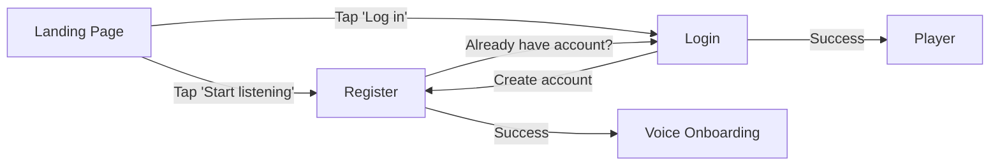
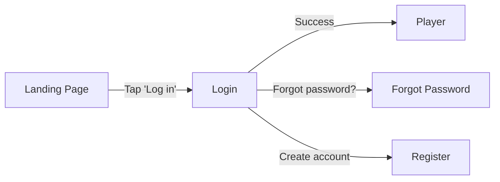

# Auth Pages Redesign - Implementation Plan

## Overview

This document outlines the UI/UX changes for redesigning the Landing, Login, and Register pages to feel like a native mobile PWA app rather than a traditional website.

## Problem Statement

The current auth experience feels "website-y" rather than "app-like":
- Landing page has multiple long marketing sections requiring excessive scrolling
- Auth forms lack mobile-first optimizations (iOS zoom issues, missing autocomplete)
- No page transitions between auth screens
- Safe area support incomplete for notched devices
- Install prompt gets lost at bottom of long landing page

## Goals

1. **Mobile-First**: Design for mobile screens first, scale up gracefully
2. **App-Like Feel**: Single-screen layouts, smooth transitions, native interactions
3. **iOS-Friendly**: Prevent zoom, respect safe areas, proper autocomplete
4. **Zero Bundle Impact**: Use existing dependencies only
5. **No Backend Changes**: Keep all API contracts unchanged

## User Flows

### New User Journey


### Returning User Journey


## UI Components

### AuthShell (New)
**Purpose**: Consistent mobile-first container for all auth screens

**Features**:
- Safe area insets (top/bottom)
- Centered content card
- Optional back button
- App branding in header
- Footer with legal links
- Animated background blobs
- Reduced motion support

**Layout**:
```
┌─────────────────────────┐
│  ← [Logo] Jamify    [ ] │ ← Header with back button
│                         │
│                         │
│   ┌─────────────────┐   │
│   │                 │   │ ← Centered card
│   │   Auth Form     │   │
│   │                 │   │
│   └─────────────────┘   │
│                         │
│  © 2024 Jamify          │ ← Footer
└─────────────────────────┘
```

### AuthField (New)
**Purpose**: Reusable form field with mobile-first optimizations

**Features**:
- 16px font-size (prevents iOS zoom)
- Fixed-height error container (no layout shift)
- Icon support (left side)
- Right element support (e.g., password toggle)
- Proper autocomplete attributes
- Accessible error announcements

**Visual**:
```
Label *
┌──────────────────────────┐
│ [Icon]  Input value      │ 16px font
└──────────────────────────┘
Error message here (20px min-height)
```

## Page Redesigns

### Landing Page

**Before**: 
- 7+ sections (hero, how-it-works, mood-personalization, training, device-mockup, testimonials, install-hint)
- Requires scrolling on mobile
- Feels like a marketing website

**After**:
- Single-screen welcome
- Centered app logo
- Short tagline
- 3 feature bullets (concise)
- Primary CTA: "Start listening"
- Secondary: "Log in"
- Integrated install prompt (subtle)
- Feels like opening an app

**Layout**:
```
        [App Logo]
        ⭐ AI-Powered Music

    Your AI DJ, tuned to your mood

    Music that adapts to you

    ✓ Learns your taste
    ✓ Mood-based playlists
    ✓ Instant playback

    ┌─────────────────────┐
    │  🎵 Start listening  │ Primary CTA
    └─────────────────────┘
    
    ┌─────────────────────┐
    │      Log in         │ Secondary
    └─────────────────────┘

    👥👥👥  10,000+ listeners
```

### Login Page

**Changes**:
- Use new AuthShell
- Migrate to react-hook-form + Zod
- Add autocomplete="email" and "current-password"
- Remove social login buttons (were disabled)
- Fixed-height error containers
- Better loading states

**Form Fields**:
1. Email (required, email validation)
2. Password (required, toggle visibility)
3. "Forgot password?" link
4. Submit button
5. "Create account" link

### Register Page

**Changes**:
- Use new AuthShell
- Migrate to react-hook-form + Zod
- Add autocomplete="new-password"
- Password strength indicator
- Fixed-height error containers
- Better validation messages

**Form Fields**:
1. Display name (optional)
2. Email (required, email validation)
3. Password (required, 8+ chars, uppercase, lowercase, number)
4. Confirm password (must match)
5. Terms checkbox (required)
6. Submit button
7. "Sign in" link

**Password Validation Rules**:
- Minimum 8 characters
- At least one uppercase letter
- At least one lowercase letter
- At least one number
- Must match confirmation

**Password Strength**:
- Weak (red): 0-2 criteria met
- Fair (yellow): 3 criteria met
- Strong (green): 4+ criteria met

## Page Transitions

**Mechanism**: AnimatePresence from framer-motion

**Transition Style**:
- Slide + fade combination
- 150ms duration (feels snappy)
- Exit animation: slide left + fade out
- Enter animation: slide from right + fade in
- Respects prefers-reduced-motion

**Affected Routes**:
- `/` ↔ `/login`
- `/` ↔ `/register`
- `/login` ↔ `/register`

## Mobile-First Optimizations

### iOS Specific
1. **Prevent Zoom on Focus**
   - All inputs: `font-size: 16px`
   - Prevents Safari zoom behavior

2. **Safe Area Support**
   - `viewport-fit=cover` in meta tag ✅ (already present)
   - `env(safe-area-inset-*)` CSS variables
   - Applied to AuthShell top/bottom padding

3. **Keyboard Handling**
   - Fixed-height error containers
   - Stable layout (no jumping)
   - Input fields stay visible

4. **Autocomplete**
   - `autocomplete="email"`: Email fields
   - `autocomplete="current-password"`: Login password
   - `autocomplete="new-password"`: Register password
   - Enables iCloud Keychain integration

### Android Specific
1. **Install Prompt**
   - Detect `beforeinstallprompt` event
   - Show "Install App" button
   - Trigger native install dialog

2. **Tap Targets**
   - Minimum 44px height on all buttons
   - Adequate spacing between interactive elements

### Cross-Platform
1. **Viewport Units**
   - Use `min-h-dvh` (dynamic viewport height)
   - Fallback to `min-h-screen` for older browsers
   - Handles mobile address bar collapse

2. **Reduced Motion**
   - Detect `prefers-reduced-motion: reduce`
   - Disable/simplify animations
   - Use existing `prefersReducedMotion()` helper

## Animation Specifications

### Landing Page Animations
```typescript
{
  logo: {
    initial: { opacity: 0, scale: 0.9 },
    animate: { opacity: 1, scale: 1 },
    duration: 250ms,
    easing: "spring"
  },
  content: {
    initial: { opacity: 0, y: 10 },
    animate: { opacity: 1, y: 0 },
    duration: 250ms,
    stagger: 100ms per element
  },
  background: {
    animate: {
      scale: [1, 1.2, 1],
      opacity: [0.3, 0.5, 0.3]
    },
    duration: 8s,
    repeat: infinite
  }
}
```

### Page Transitions
```typescript
{
  exit: {
    opacity: 0,
    x: -20,
    duration: 150ms
  },
  enter: {
    opacity: 0,
    x: 20,
    duration: 150ms
  }
}
```

### Form Animations
```typescript
{
  error: {
    initial: { opacity: 0, y: -10 },
    animate: { opacity: 1, y: 0 },
    duration: 150ms
  },
  passwordStrength: {
    width: { duration: 300ms }
  }
}
```

## Validation Rules

### Email
- Required
- Must match email regex
- Error: "Please enter a valid email address"

### Login Password
- Required
- Error: "Password is required"

### Register Password
- Required
- Minimum 8 characters
- At least one uppercase letter
- At least one lowercase letter
- At least one number
- Errors:
  - "Password must be at least 8 characters"
  - "Password must contain at least one uppercase letter"
  - "Password must contain at least one lowercase letter"
  - "Password must contain at least one number"

### Confirm Password
- Must match password
- Error: "Passwords do not match"

### Terms Checkbox
- Must be checked
- Error: "You must accept the Terms and Privacy Policy"

## Accessibility

### Keyboard Navigation
- All interactive elements focusable
- Tab order follows visual order
- Enter key submits forms
- Escape key closes modals (if applicable)

### Screen Readers
- Proper label associations (`htmlFor` / `id`)
- Error messages announced (`aria-live="polite"`)
- Loading states announced
- Form validation feedback clear

### Error Handling
- Errors displayed below fields
- Fixed-height containers (no layout shift)
- First invalid field auto-focused
- Clear, actionable error messages

### Color Contrast
- All text meets WCAG AA standards
- Error messages use destructive color
- Success states use success color
- Disabled states clearly indicated

## Responsive Breakpoints

### Mobile (< 640px)
- Full-width card
- Stacked buttons
- Touch-friendly tap targets (44px+)

### Tablet (640px - 1024px)
- Centered card (max-width: 448px)
- Same layout as mobile

### Desktop (> 1024px)
- Centered card (max-width: 448px)
- Hover states on interactive elements
- Keyboard shortcuts enabled

## Install Prompt Strategy

### Timing
- Show after 3 seconds on landing page
- Don't show if dismissed in last 7 days
- Don't show if already installed

### iOS Behavior
- Show instructions card
- Icon: Share button
- Text: "Tap Share, then 'Add to Home Screen'"
- Dismissible (saves to localStorage)

### Android Behavior
- Detect `beforeinstallprompt` event
- Show "Install App" button
- Trigger native prompt on click
- Dismissible (saves to localStorage)

### Position
- Bottom of screen (mobile)
- Non-blocking overlay
- Doesn't interfere with CTAs

## Theme Support

All components support dark mode (already implemented in project):
- Use CSS custom properties for colors
- `--background`, `--foreground`, `--card`, etc.
- Gradient backgrounds use theme colors
- No hardcoded color values

## Files Structure

```
frontend/src/
├── components/
│   └── auth/
│       ├── AuthShell.tsx         (new)
│       ├── AuthField.tsx         (new)
│       ├── login-form.tsx        (refactored)
│       ├── register-form.tsx     (refactored)
│       └── auth-layout.tsx       (deprecated)
├── pages/
│   ├── LandingPage.tsx           (redesigned)
│   ├── LoginPage.tsx             (simplified)
│   └── RegisterPage.tsx          (simplified)
├── App.tsx                       (added AnimatePresence)
└── index.css                     (added utilities)

frontend/docs/
├── auth_redesign_research.md     (new)
├── auth_redesign_plan.md         (this file)
└── auth_redesign_checklist.md    (new)
```

## Testing Plan

### Manual Testing
- [ ] Test on iPhone Safari (not installed)
- [ ] Test on iPhone PWA (installed)
- [ ] Test on Android Chrome
- [ ] Test on desktop browsers
- [ ] Test keyboard navigation
- [ ] Test screen reader (VoiceOver/TalkBack)
- [ ] Test reduced motion preference

### Automated Testing
- [ ] TypeScript compilation succeeds
- [ ] No linter warnings
- [ ] Build completes successfully
- [ ] Bundle size within acceptable range

### Edge Cases
- [ ] Very long email addresses
- [ ] Special characters in passwords
- [ ] Network errors during submission
- [ ] Double-submit prevention
- [ ] Back button during form submission

## Success Metrics

### UX Improvements
- No iOS zoom on input focus
- No layout shift on errors
- Smooth page transitions (60fps)
- Install prompt visible and actionable

### Technical
- Bundle size unchanged (0 KB impact)
- Build time similar to before
- No TypeScript errors
- No linter warnings

### User-Facing
- Login/register success rates maintained
- Install prompt conversion rate measurable
- Mobile bounce rate reduced
- Time to first interaction improved

## Rollback Plan

If issues arise:
1. Old `auth-layout.tsx` still in codebase
2. No backend changes, safe to revert frontend
3. Simple git revert + redeploy
4. No database migrations needed

## Future Enhancements

### Phase 2 (Future)
- Biometric authentication (Face ID / Touch ID)
- Social login (Google / Apple)
- Password autosave to localStorage
- Form persistence across sessions
- Haptic feedback on errors
- A/B testing for install prompt

### Phase 3 (Future)
- Magic link authentication
- WebAuthn / Passkeys
- Multi-factor authentication
- Account recovery flow
- Email verification flow

## References

- [PWA Install Prompt Best Practices](https://web.dev/learn/pwa/installation-prompt/)
- [iOS Safe Area Insets](https://webkit.org/blog/7929/designing-websites-for-iphone-x/)
- [React Hook Form Documentation](https://react-hook-form.com/)
- [Zod Validation](https://zod.dev/)
- [Framer Motion AnimatePresence](https://www.framer.com/motion/animate-presence/)

